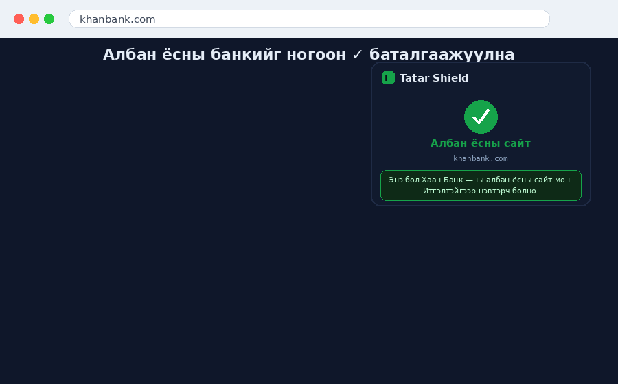
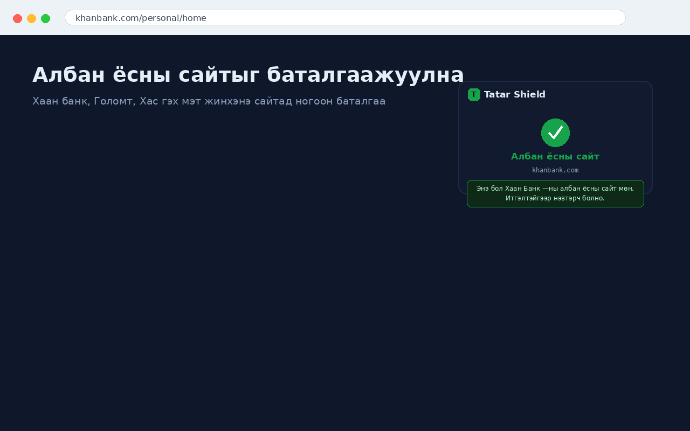
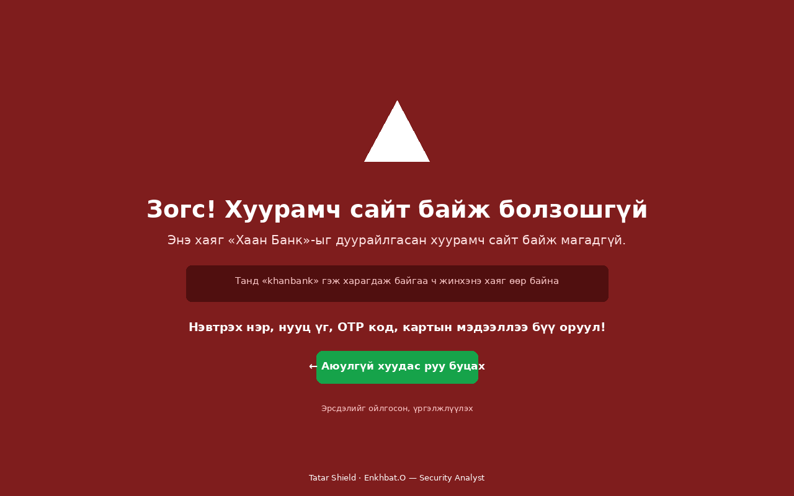
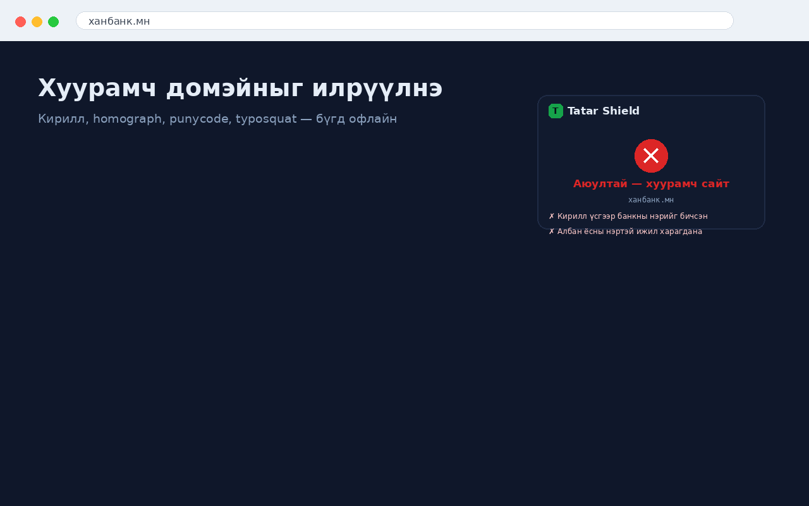
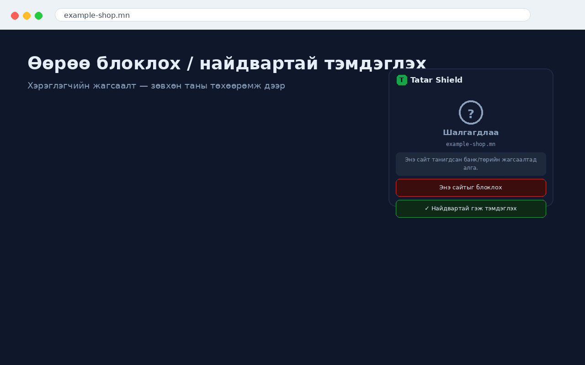

# 🛡️ Tatar Shield — Фишингээс хамгаалагч

> Монголын банк, төрийн сайтуудын **дуураймал (фишинг) хаягийг** илрүүлж,
> нууц үг/OTP алдахаас өмнө анхааруулдаг хөнгөн, **офлайн** хөтчийн өргөтгөл.
> A lightweight, **offline** browser extension that protects Mongolian users from
> look-alike (phishing) domains of local banks & government sites.

---

## 🎬 Демо

## 📸 Дэлгэцийн зураг / Screenshots

| Албан ёсны сайт / Official | Хуурамч сайт (блок) / Blocked fake |
|---|---|
|  |  |

| Илрүүлэлт / Detection | Хэрэглэгчийн жагсаалт / User lists |
|---|---|
|  |  |

---

# 🇲🇳 Монголоор

Chrome, Edge, Firefox дээр ажиллана. Бүх шалгалт хөтөч дотор **локал** хийгддэг —
ямар ч мэдээлэл цуглуулдаггүй, сервер рүү илгээдэггүй, телеметргүй.

## ✨ Онцлог
- 🟢 **Ногоон баталгаа** — албан ёсны банк/төрийн сайтыг зөв гэдгийг харуулна.
- 🟡 **Шар анхааруулга** — сэжигтэй хаягийг мэдэгдэнэ.
- 🔴 **Улаан блок хуудас** — хуурамч сайтад бүх дэлгэцийг хааж зогсооно.
- 🇲🇳 **Монголд тааруулсан** — кирилл банкны нэр, IDN homograph, дижитал банк.
- 🔒 **Offline & privacy-first** — гадны дуудлагагүй, `storage.local` дээр л хадгална.
- 📝 **Blacklist / Whitelist** — хэрэглэгч өөрөө блоклох / найдвартай тэмдэглэх.

## 🔍 Илрүүлдэг халдлагууд
| Төрөл | Жишээ | Түвшин |
|-------|-------|--------|
| Кирилл/латин холимог (IDN homograph) | `хacbank.mn` | 🔴 Өндөр |
| Кирилл банкны нэр | `ханбанк.мн` | 🔴 Өндөр |
| Punycode | `xn--80ak6aa92e.com` | 🔴 Өндөр |
| Грек / fullwidth тэмдэгт | `κhanbanκ.mn`, `ｋｈａｎｂａｎｋ.mn` | 🔴 Өндөр |
| Яг брэнд нэр, өөр TLD | `khanbank.net` | 🔴 Өндөр |
| Typosquat / combosquat | `golom6tbank.com`, `mbank-secure.com` | 🟡 Сэжигтэй |

## 🧮 Оноололт
`≥ 70` → 🔴 Өндөр (блок) · `35–69` → 🟡 Сэжигтэй (banner) · `< 35` → 🟢 Хэвийн

Аргачлал: албан ёсны домэйний allow-list + Unicode confusable "skeleton" +
Levenshtein зай + кирилл банкны нэрийн жагсаалт. Бүгд офлайн.

## 🚀 Суулгах (unpacked)
**Chrome / Edge:** `chrome://extensions` → **Developer mode** асаах → **Load unpacked** → энэ хавтсыг сонгох.
**Firefox:** `about:debugging#/runtime/this-firefox` → **Load Temporary Add-on…** → `manifest.json`.

> 🎥 **Суулгах бичлэг:** алхам алхмаар суулгах дэлгэцийн бичлэгийг [docs/recording-guide-mn.md](docs/recording-guide-mn.md) зааврын дагуу бичиж, энд оруулж болно.

## 🏦 Хамрагдсан байгууллага
- **12 арилжааны банк** (Монголбанкны лицензтэй) + дижитал банк — бүрэн хамгаалалттай.
- **Гол төрийн сайт:** e-mongolia, gov.mn, mta.
- **Крипто/дижитал хөрөнгийн бирж:** CoinHub, Complex, Trade.mn, CoreX, X-Meta.
- **Банк бус санхүү / финтек:** LendMN, Storepay, Ard Credit, Pocket, Most, Toki, SendMN, Moni, Simple, Netcapital.

Крипто/финтек нэрс нь түгээмэл үгтэй тул зөвхөн ногоон баталгаанд (allowlist) ашиглаж,
дэлхийн жинхэнэ сайтуудыг андуурахаас сэргийлж look-alike илрүүлэлтэд оруулаагүй.
Жагсаалтыг `src/lib/banks.js`-ээс шинэчилнэ — [CONTRIBUTING.md](CONTRIBUTING.md).

## 🧪 Тест
`test/logic-test.html`-ийг браузераар нээхэд бүх кейс PASS байх ёстой.

## 🔐 Нууцлал
Ямар ч мэдээлэл цуглуулдаггүй. Дэлгэрэнгүй: [PRIVACY.md](PRIVACY.md).

---

# 🇬🇧 English

Tatar Shield is a lightweight, offline phishing-protection extension for Mongolian
users. All checks run locally in your browser — **no data is collected**, nothing is
sent to any server, no telemetry.

## Features
- 🟢 **Green** confirmation on official bank / government sites.
- 🟡 **Yellow** banner on suspicious addresses.
- 🔴 **Red full-screen block** on fake look-alike sites (before you type a password/OTP).
- 🇲🇳 Tuned for Mongolia: Cyrillic bank names, IDN homographs, digital-bank domains.
- 🔒 Offline & privacy-first (`storage.local` only).
- 📝 User Blacklist / Whitelist.

## Detected attacks
Mixed Cyrillic/Latin (IDN homograph, `хacbank.mn`), Cyrillic bank names
(`ханбанк.мн`), punycode (`xn--…`), Greek/fullwidth confusables (`κhanbanκ.mn`),
exact brand on a different TLD (`khanbank.net`), typosquat/combosquat.

## Scoring
`≥ 70` → high (block) · `35–69` → suspicious (banner) · `< 35` → safe.
Method: official-domain allow-list + Unicode confusable skeleton + Levenshtein
distance + Cyrillic brand-name list. Fully offline.

## Install (unpacked)
**Chrome / Edge:** `chrome://extensions` → Developer mode → Load unpacked → this folder.
**Firefox:** `about:debugging` → Load Temporary Add-on… → `manifest.json`.

## Privacy
No data collected — see [PRIVACY.md](PRIVACY.md). Store review notes: [docs/permissions.md](docs/permissions.md).

## License
[MIT](LICENSE) © 2026 **Enkhbat.O — Security Analyst**
