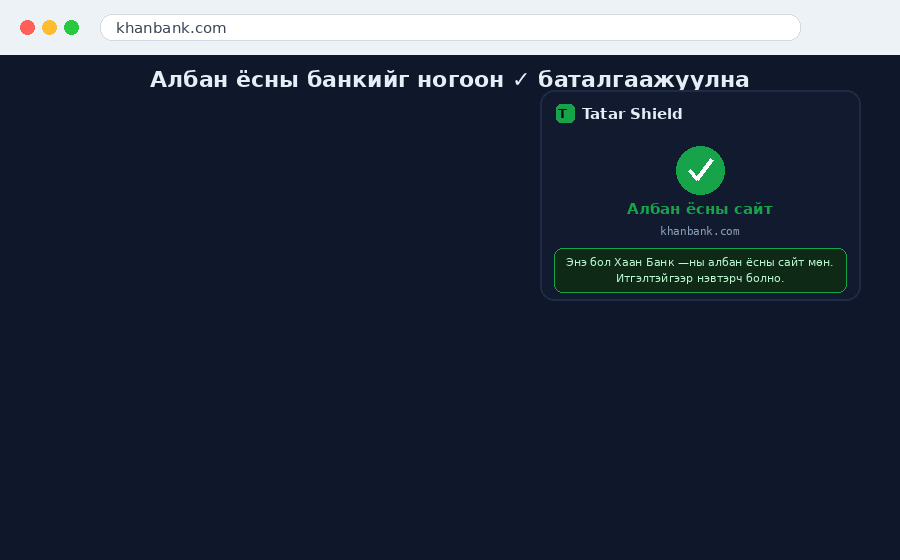
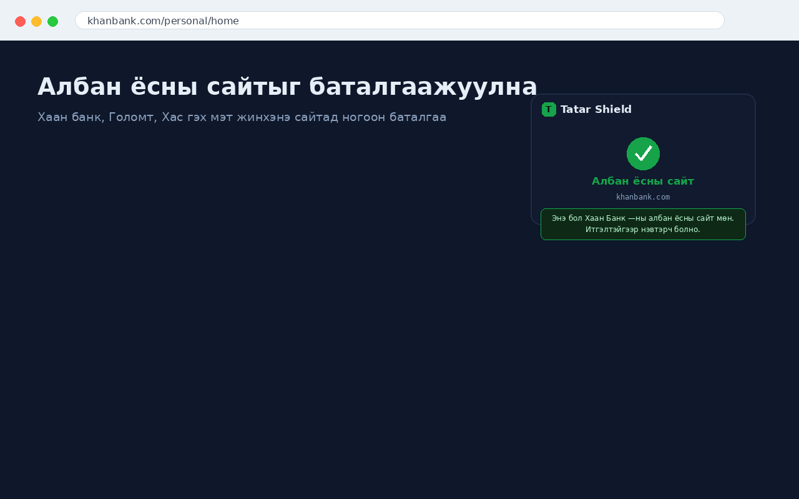
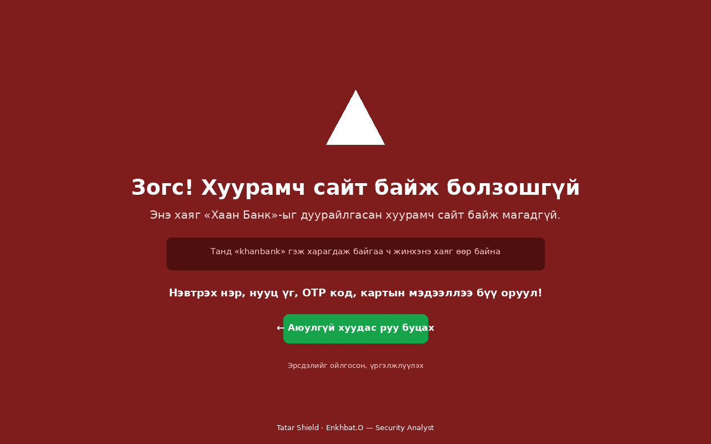
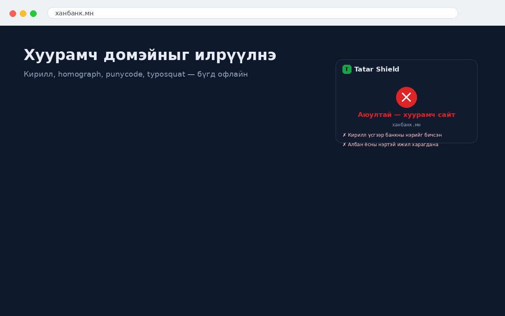
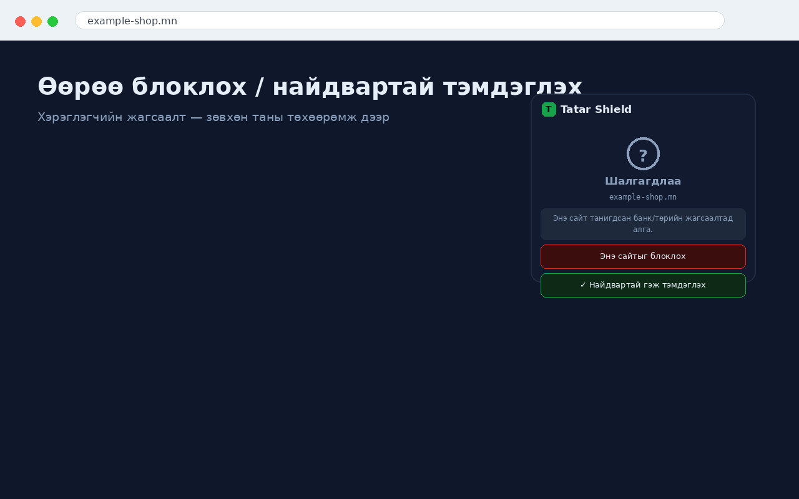

# 🛡️ Tatar Shield — Фишингээс хамгаалагч

> Монголын банк, төрийн сайтуудын **дуураймал (фишинг) хаягийг** илрүүлж,
> нууц үг/OTP алдахаас өмнө анхааруулдаг хөнгөн, **офлайн** хөтчийн өргөтгөл.
> A lightweight, **offline** browser extension that protects Mongolian users from
> look-alike (phishing) domains of local banks & government sites.


---

## 🏪 Store-оос суулгах / Install from Store

| Browser | Линк |
|---------|------|
| Chrome | [](https://chromewebstore.google.com/detail/gbcclomjnodendjigeckdbefeiflabhk) |
| Edge | [](https://microsoftedge.microsoft.com/addons/detail/tatar-shield-%E2%80%94-%D1%84%D0%B8%D1%88%D0%B8%D0%BD%D0%B3%D1%8D%D1%8D%D1%81/pfbblpkfahgbedpbajadbenjhkjibekl) |

---

## 🎬 Демо



## 📸 Дэлгэцийн зураг / Screenshots

| Албан ёсны сайт / Official | Хуурамч сайт (блок) / Blocked fake |
|---|---|
|  |  |

| Илрүүлэлт / Detection | Хэрэглэгчийн жагсаалт / User lists |
|---|---|
|  |  |

---

# 🇲🇳 Монголоор

Chrome, Edge, Firefox дээр ажиллана. Бүх шалгалт хөтөч дотор **локал** хийгддэг —
ямар ч мэдээлэл цуглуулдаггүй, сервер рүү илгээдэггүй, телеметргүй.

## ✨ Онцлог
- 🟢 **Ногоон баталгаа** — албан ёсны банк/төрийн сайтыг зөв гэдгийг харуулна.
- 🟡 **Шар анхааруулга** — сэжигтэй хаягийг мэдэгдэнэ.
- 🔴 **Улаан блок хуудас** — хуурамч сайтад бүх дэлгэцийг хааж зогсооно.
- 🇲🇳 **Монголд тааруулсан** — кирилл банкны нэр, IDN homograph, дижитал банк.
- 🔒 **Offline & privacy-first** — гадны дуудлагагүй, `storage.local` дээр л хадгална.
- 📝 **Blacklist / Whitelist** — хэрэглэгч өөрөө блоклох / найдвартай тэмдэглэх.

## 🔍 Илрүүлдэг халдлагууд
| Төрөл | Жишээ | Түвшин |
|-------|-------|--------|
| Кирилл/латин холимог (IDN homograph) | `хacbank.mn` | 🔴 Өндөр |
| Кирилл банкны нэр | `ханбанк.мн` | 🔴 Өндөр |
| Punycode + брэндийн шинж | `xn--80ak6aa92e.com` | 🔴 Өндөр |
| Грек / fullwidth тэмдэгт | `κhanbanκ.mn`, `ｋｈａｎｂａｎｋ.mn` | 🔴 Өндөр |
| Яг брэнд нэр, өөр TLD | `khanbank.net` | 🔴 Өндөр |
| Typosquat / combosquat | `golom6tbank.com`, `mbank-secure.com` | 🟡 Сэжигтэй |

> ℹ️ **Punycode нь өөрөө анхааруулга БИШ.** `xn--…` хэлбэр нь зөвхөн брэндийн
> шинжтэй (кирилл банкны нэр, латин заль, skeleton тааралт) хамт гарвал оноо
> болно. Тиймээс `монгол.mn`, `москва.рф`, `한국.kr`, `日本.jp` мэт дэлхийн
> ердийн IDN сайт дээр анхааруулга ГАРАХГҮЙ.

## 🧮 Оноололт
`≥ 70` → 🔴 Өндөр (блок) · `35–69` → 🟡 Сэжигтэй (banner) · `< 35` → 🟢 Хэвийн

Аргачлал: албан ёсны домэйний allow-list + Unicode confusable "skeleton" +
Levenshtein зай + кирилл банкны нэрийн жагсаалт. Бүгд офлайн.

## 🚀 Суулгах (unpacked)
**Chrome / Edge:** `chrome://extensions` → **Developer mode** асаах → **Load unpacked** → энэ хавтсыг сонгох.
**Firefox:** `about:debugging#/runtime/this-firefox` → **Load Temporary Add-on…** → `manifest.json`.

> 🎥 **Суулгах бичлэг:** алхам алхмаар суулгах дэлгэцийн бичлэгийг [docs/recording-guide-mn.md](docs/recording-guide-mn.md) зааврын дагуу бичиж, энд оруулж болно.

## 🏦 Хамрагдсан байгууллага
- **12 арилжааны банк** (Монголбанкны лицензтэй) + дижитал банк — бүрэн хамгаалалттай.
- **Гол төрийн сайт:** e-mongolia.mn, gov.mn, mta.mn, ndaatgal.mn — болон тэдгээрийн бүх subdomain (*.gov.mn автоматаар).
- **Крипто/дижитал хөрөнгийн бирж:** CoinHub, Complex, Trade.mn, CoreX, X-Meta.
- **Банк бус санхүү / финтек:** LendMN, Storepay, Ard Credit, Pocket, Most, Toki, SendMN, Moni, Simple, Netcapital.

Крипто/финтек нэрс нь түгээмэл үгтэй тул зөвхөн ногоон баталгаанд (allowlist) ашиглаж,
дэлхийн жинхэнэ сайтуудыг андуурахаас сэргийлж look-alike илрүүлэлтэд оруулаагүй.
Лицензтэй банкны ТҮГЭЭМЭЛ ҮГТЭЙ нэрс (`mbank`, `ibank`, `statebank`, `transbank`)
нь homograph / skeleton / subdomain шалгалтад хэвээр хамрагдах боловч "яг ижил
нэр, зөвхөн өөр TLD" гэдэг ЦОРЫН ГАГЦ шалгуураас чөлөөлөгдсөн — `mbank.pl`,
`transbank.cl`, `statebank.com` нь дэлхийн ЖИНХЭНЭ банкууд.

Энэ чөлөөлөлт `ckbank`, `nibank`, `e-nibank`, `etransbank`-д ХАМААРАХГҮЙ:
эдгээр нь түгээмэл үг биш, лицензтэй банкны ЯГ брэнд нэр (Чингис Хаан Банк,
NIBank, Тээвэр Хөгжлийн Банк) тул `ckbank.com`, `nibank.com` нь 🔴 блоклогдоно.
Жагсаалтыг `src/lib/banks.js`-ээс шинэчилнэ — [CONTRIBUTING.md](CONTRIBUTING.md).

## 🧪 Тест

```bash
node --test
```

Гадны хамаарал ШААРДАХГҮЙ (node-ийн өөрийн test runner). `test/run.js` нь
`src/lib`-ийг шууд ачаалж дараах корпусуудыг шалгана:

- **MUST_BE_SAFE** — жинхэнэ банк/төрийн сайт, Монгол кирилл домэйн
  (`монгол.mn`, `мөнх.mn`), дэлхийн ердийн IDN сайт болон хоёр түвшний
  суффикстэй гадны хаяг (`bank.gov.ua`, `tdb.co.jp`) дээр анхааруулга
  **ГАРАХГҮЙ**.
- **MUST_BE_HIGH** — дуураймал хаягийг **өнгөрүүлэхгүй** (`ckbank.com`,
  `nibank.com`, `khanbank.com.pl`).
- **IDN_FORMS** — homograph-ийг Unicode (`аррӏе.mn`) БА хөтөч буцаадаг
  punycode (`xn--80ak6aa92e.mn`) хэлбэр хоёуланг шалгана.

Браузераар: `test/logic-test.html`-ийг нээхэд бүх кейс PASS байх ёстой
(хуудас нь `src/lib`-ийн жинхэнэ файл болон `test/cases.js`-ийн ЯГ ижил
кейсүүдийг ачаалдаг — хуулбар байхгүй).

## 🔐 Нууцлал
Ямар ч мэдээлэл цуглуулдаггүй. Дэлгэрэнгүй: [PRIVACY.md](PRIVACY.md).

---

# 🇬🇧 English

Tatar Shield is a lightweight, offline phishing-protection extension for Mongolian
users. All checks run locally in your browser — **no data is collected**, nothing is
sent to any server, no telemetry.

## Features
- 🟢 **Green** confirmation on official bank / government sites.
- 🟡 **Yellow** banner on suspicious addresses.
- 🔴 **Red full-screen block** on fake look-alike sites (before you type a password/OTP).
- 🇲🇳 Tuned for Mongolia: Cyrillic bank names, IDN homographs, digital-bank domains.
- 🔒 Offline & privacy-first (`storage.local` only).
- 📝 User Blacklist / Whitelist.

## Detected attacks

| Type | Example | Level |
|---|---|---|
| Mixed Cyrillic/Latin (IDN homograph) | `хacbank.mn` | 🔴 High |
| Cyrillic bank name | `ханбанк.мн` | 🔴 High |
| Punycode + a brand signal | `xn--80ak6aa92e.com` | 🔴 High |
| Greek / fullwidth confusables | `κhanbanκ.mn`, `ｋｈａｎｂａｎｋ.mn` | 🔴 High |
| Exact brand, different TLD | `khanbank.net` | 🔴 High |
| Typosquat / combosquat | `golom6tbank.com`, `mbank-secure.com` | 🟡 Suspicious |

> ℹ️ **Punycode is not a warning on its own.** An `xn--…` host only scores when
> a brand signal comes with it (Cyrillic bank name, Latin-look-alike label,
> skeleton match), so ordinary IDN sites — `монгол.mn`, `москва.рф`, `한국.kr`,
> `日本.jp` — stay green.
>
> ℹ️ **Common-word brand cores** (`mbank`, `ibank`, `statebank`, `transbank`)
> are exempt from the "exact brand, different TLD" rule *only*, because real
> foreign banks own `mbank.pl`, `transbank.cl` and `statebank.com`; the
> homograph / skeleton / subdomain rules still apply to them. The exemption does
> **not** cover `ckbank`, `nibank`, `e-nibank` or `etransbank` — those are the
> exact brand cores of licensed Mongolian banks, so `ckbank.com` and
> `nibank.com` are blocked.

## Scoring
`≥ 70` → high (block) · `35–69` → suspicious (banner) · `< 35` → safe.
Method: official-domain allow-list + Unicode confusable skeleton + Levenshtein
distance + Cyrillic brand-name list. Fully offline.

## Install (unpacked)
**Chrome / Edge:** `chrome://extensions` → Developer mode → Load unpacked → this folder.
**Firefox:** `about:debugging` → Load Temporary Add-on… → `manifest.json`.

## Tests

```bash
node --test
```

No dependencies (node's built-in test runner). `test/run.js` loads the real
`src/lib` and asserts three corpora: **MUST_BE_SAFE** — no warning on real
banks, government sites, ordinary Mongolian Cyrillic domains (`монгол.mn`,
`мөнх.mn`) or foreign two-level registrations (`bank.gov.ua`, `tdb.co.jp`);
**MUST_BE_HIGH** — look-alike domains are never missed (`ckbank.com`,
`nibank.com`, `khanbank.com.pl`); and **IDN_FORMS** — every homograph is checked
in both spellings, Unicode (`аррӏе.mn`) and the punycode form a browser actually
reports (`xn--80ak6aa92e.mn`). `test/logic-test.html` runs the very same cases in
a browser — both loaders read `test/cases.js`, so the two lists cannot drift.

## Privacy
No data collected — see [PRIVACY.md](PRIVACY.md). Store review notes: [docs/permissions.md](docs/permissions.md).

## License
[MIT](LICENSE) © 2026 **Enkhbat.O — Security Analyst**


